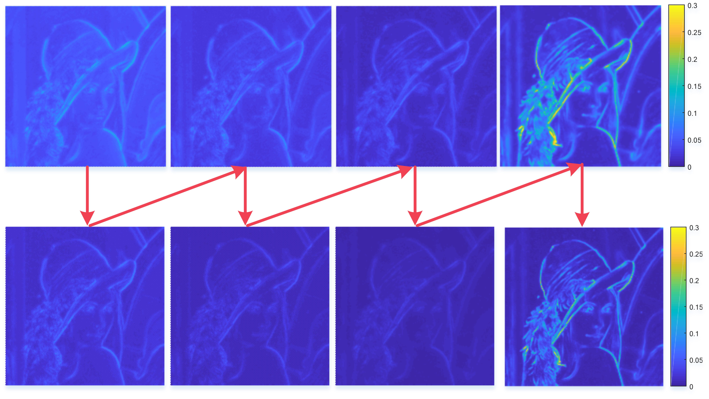
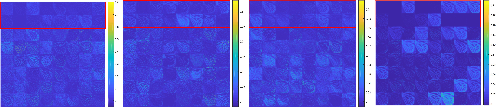

# IDN-Caffe
Caffe implementation of "Fast and Accurate Single Image Super-Resolution via Information Distillation Network" 

[[arXiv]](http://arxiv.org/abs/1803.09454) [[CVF]](http://openaccess.thecvf.com/content_cvpr_2018/html/Hui_Fast_and_Accurate_CVPR_2018_paper.html) [[Poster]](files/cvpr18_poster.pdf)

<p align="center">
     <br />
    <em> The schematics of the proposed Information Distillation Network</em>
</p>

<p align="center">
    <em> The average feature maps of enhancement units </em>
     <br />
    <em> The average feature maps of compression units </em>
</p>

<p align="center">
     <br />
    <em> Visualization of the output feature maps of the third convolution in each enhancement unit </em>
</p>


## Testing
* Install Caffe, Matlab R2013b
* Run testing:
```bash
$ cd ./test
$ matlab
>> test_IDN
```
**Note:** Please make sure the matcaffe is complied successfully.

`./test/caffemodel/IDN_x2.caffemodel`, `./test/caffemodel/IDN_x3.caffmodel` and `./test/caffemodel/IDN_x4.caffemodel` are obtained by training the model with 291 images, and `./test/caffemodel/IDN_x4_mscoco.caffemodel` is got through training the same model with mscoco dataset.

The results are stored in "results" folder, with both reconstructed images and PSNR/SSIM/IFCs.
## Training
* step 1: Compile Caffe with `train/include/caffe/layers/l1_loss_layer.hpp`, `train/src/caffe/layers/l1_loss_layer.cpp` and `train/src/caffe/layers/l1_loss_layer.cu`
* step 2: Run `data_aug.m` to augment 291 dataset
* step 3: Run `generate_train_IDN.m` to convert training images to hdf5 file
* step 4: Run `generate_test_IDN.m` to convert testing images to hdf5 file for valid model during the training phase
* step 5: Run `train.sh` to train x2 model (Manually create directory `caffemodel_x2`)
## Resultsp
[[Set5] [Set14] [B100] [Urban100] [Manga109]](https://drive.google.com/open?id=1J49xNQtbgFAs-Q2LWFRnzIlvv67CTznB)

## Citation

If you find IDN useful in your research, please consider citing:

```
@inproceedings{Hui-IDN-2018,
  title={Fast and Accurate Single Image Super-Resolution via Information Distillation Network},
  author={Hui, Zheng and Wang, Xiumei and Gao, Xinbo},
  booktitle={CVPR},
  pages = {723--731},
  year={2018}
}
```
